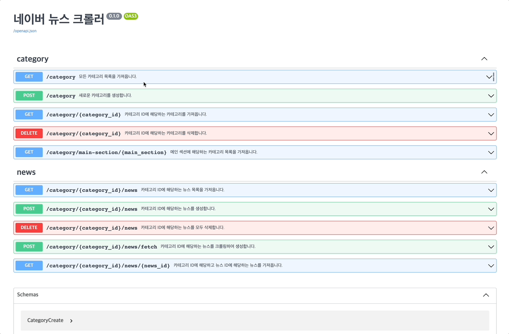
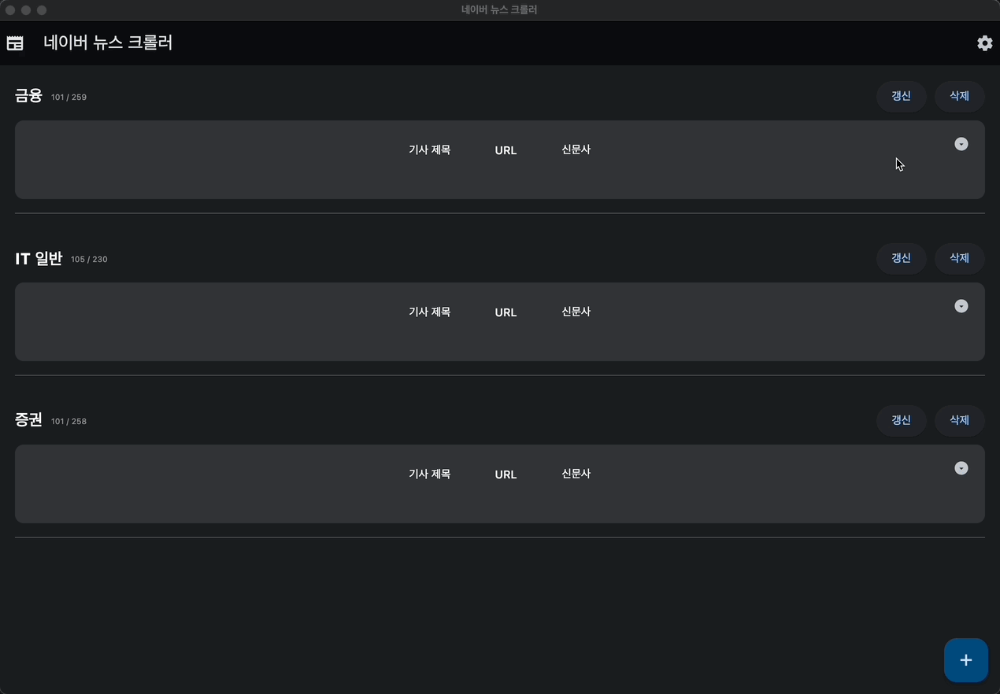

# 파이썬을 이용한 웹 자동화 스터디 자료

- 정적 웹 크롤링, 동적 웹 크롤링, DB 활용, GUI 프로그램 제작 등을 학습합니다.
- 학습한 내용을 기반으로 실제 운영 가능한 프로그램을 만드는 것을 목표로 합니다.
- 본 스터디를 통해 생성된 코드는 교육 목적으로만 사용되며, 다른 목적으로 사용하지 아니합니다.

## [Part1. 정적 웹 크롤링](part1_static_crawling/)

- `requests`, `bs4` 등을 이용하여 정적 웹 크롤링하는 방법을 익힙니다.
- [여기](https://www.inflearn.com/course/%ED%8C%8C%EC%9D%B4%EC%8D%AC-%ED%81%AC%EB%A1%A4%EB%A7%81-%EA%B8%B0%EC%B4%88)에서 강의를 보고 공부합니다.

## [Part2. 동적 웹 크롤링](part2_dynamic_crawling/)

- `playwright`를 이용한 동적 크롤링하는 방법을 익힙니다.

  
  

## [Part3. DB 활용하기](part3_with_database/)

- `sqlalchemy`와 `pydantic`을 이용하여 DB를 활용하는 방법을 익힙니다.

  

## [Part4. web, gui 적용 및 pyinstaller 활용하기](part4_web_gui_pyinstaller/)

- `fastapi`를 활용한 웹 프레임워크를 찍먹해 봅니다.
- `flet`을 활용한 gui 프로그램을 찍먹해 봅니다.
- `pyinstaller`를 이용하여 GUI 프로그램을 만드는 방법을 익힙니다.

  
  

## [Etc. Playwright tutorial](etc_playwright_tutorial/)

- playwright에 대한 이해와 사용법을 익힙니다.

  
